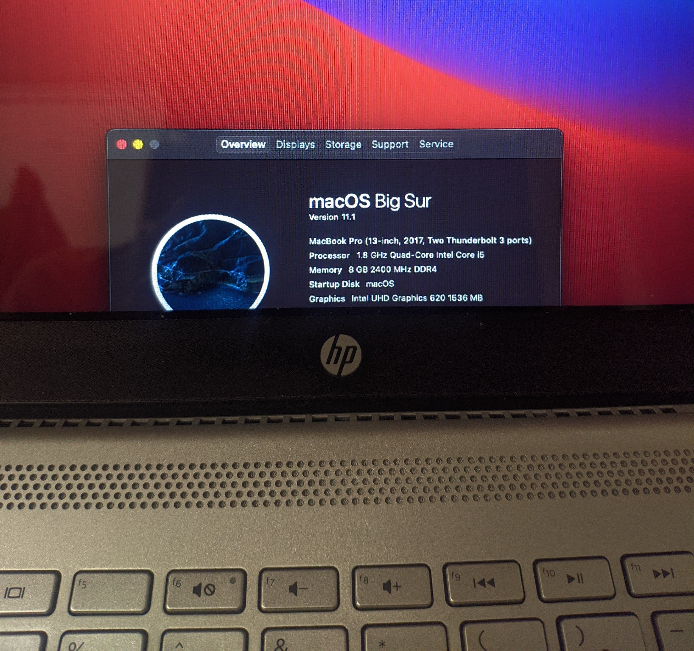

# HP Pavilion 14 bf100 Hackintosh with OpenCore
## Overview
 
<strong>macOS Big Sur</strong>

 

<!--

 
<strong>macOS Catalina</strong>

 

 

 -->
- macOS version: Big Sur 11.1 (20C69)
- OpenCore version: 0.6.5

## Midifications from HP Pavilion 15 cs0101TX
- Different pci ids for iGPU to work
- Remapped USB injection for SD card reader
- Replaced Replaced Intel WiFi kexts with Dell DW1820A kexts, and added new pci entry
    - Removed
        - AirportItlwm.kext
        - IntelBluetoothInjector.kext
        - IntelBluetoothFirmware.kext with 
    - Added
        - AirportBrcmFixup.kext
        - BrcmBluetoothInjector.kext
        - BrcmFirmwareData.kext
        - BrcmPatchRAM3.kext
- Removed unused kexts and SSDT
    - RtWlanU.kext
    - RtWlanU1827.kext
    - SSDT-dGPU-Off.aml

## Hardware Specifications 
| Category | Detail |
|:----:|:----:|
| Product name | HP Pavilion - 14-bf100 |
| BIOS Version | F.47 Rev.A |
| Microprocessor | Intel® Core™ i5-8250U (1.6 GHz base frequency, up to 3.4 GHz with Intel® Turbo Boost Technology, 6 MB cache, 4 cores)|
| iGPU | Intel® UHD Graphics 620 |
| Memory | 8GB DDR4-2400 SDRAM (1 x 8 GB) |
| m.2 Drive | Sandisk SD9SN8W-256G-1006 | 
| SATA Drive | Samsung 840 Evo 120GB | 
| Display | 14" (1920 x 1080) |
| Keyboard | Full-size island-style keyboard with numeric keypad, PS/2 |
| Pointing device | HP Imagepad with multi-touch gesture support, PS/2 |
| Wireless connectivity | Dell DW1820A (CN-096JNT) |
| Network interface | Integrated 10/100/1000 GbE LAN (Realtek RTL8111) |
| Expansion slots | 1 multi-format SD media card reader |
| External ports | 2 USB 3.1 Gen 1 (Data transfer only); 1 HDMI 1.4; 1 headphone/microphone combo; 1 USB 3.1 Type-C™ Gen 1 (Data Transfer Only); 1 RJ-45 | 

## BIOS settings
- Virtualization:   Enabled
- Secure Boot:  Disabled
- Intel SGX:    Disabled

## Hardware modifications
- Replaced Intel Wireless AC-7265 with Dell DW1820A (CN-096JNT) for native wifi with PEAP-MSCHAPv2 support. 
- Added the SATA SSD for macOS

## What doesn't work
- Bluetooth on DW1820A not detected even with acidanthera's [BrcmPatchRAM](https://github.com/acidanthera/BrcmPatchRAM)
- Battery percentage is broken
